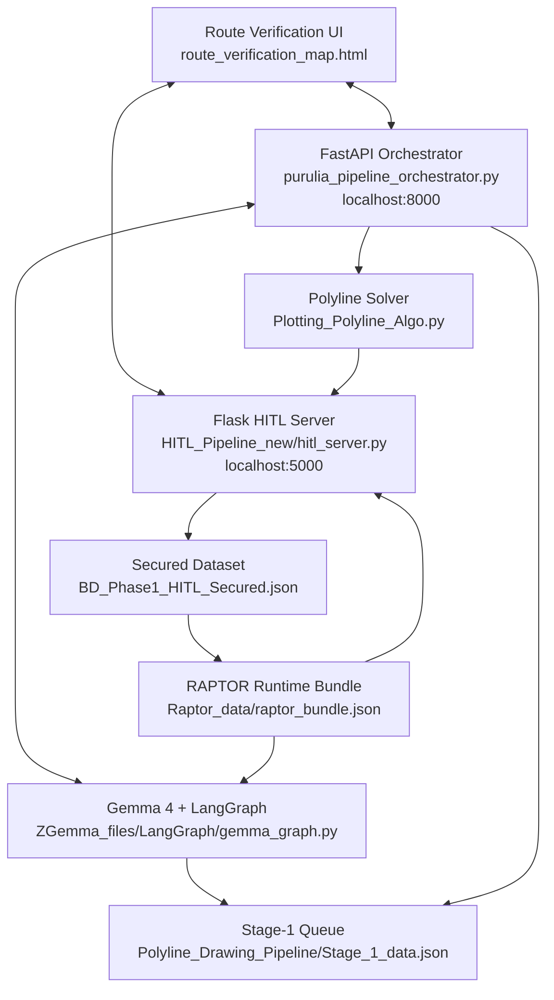

# Rural Bus Transit Intelligence

Purulia District & Nearby Region Focus

AI-assisted rural bus intelligence for converting informal bus knowledge into validated, searchable, map-ready transit infrastructure.

[](https://www.python.org/)
[](https://fastapi.tiangolo.com/)
[](https://flask.palletsprojects.com/)
[](https://langchain-ai.github.io/langgraph/)
[](https://ai.google.dev/gemma)

## Executive Summary

Rural Bus Transit Intelligence is a working prototype for rural transit digitization, validation, and discovery. The first iteration is designed around Purulia district and its nearby inter-district/inter-state transport region, where rural mobility connects villages, markets, schools, hospitals, rail links, and daily social life.

The system turns messy route knowledge into a staged transport record, computes route geometry, presents it for human audit, secures the approved result, and exposes the network through route search, timetable inspection, map visualization, and RAPTOR-based journey planning.

This is not a generic chatbot over transport files. The project is a coordinated pipeline with state management, duplicate guards, atomic writes, validation stages, map recomputation, secured snapshots, proximity analysis, and routing data generation.

## Regional Focus

Purulia is the westernmost district of West Bengal: a predominantly rural plateau region connecting Bengal, Jharkhand, and Odisha. With more than 2,600 villages spread across forests, hills, and low-density settlements, public transportation plays a vital role in daily life.

For many communities, buses are not only a transport option. They support access to:

- education,
- healthcare,
- local markets,
- railway connectivity,
- family responsibilities,
- and social relationships within a deeply community-oriented society.

The district spans approximately 6,259 sq. km and recorded a population of about 2.93 million in the 2011 Census. Based on moderated demographic growth projections, Purulia's estimated population in 2026 is expected to reach approximately 3.2-3.4 million people.

Despite likely operating nearly 1,000 active buses across government and private rural routes, the current structured transit database in this project contains around 115 mapped services. That gap is the core motivation for the system: rural transit exists, but its digital infrastructure is severely incomplete.

The project begins with Purulia and nearby regions because the area is large enough to expose real routing complexity, rural enough to lack structured transit feeds, and socially dependent enough for discoverable mobility to matter.

## Problem

Large parts of rural India do not have structured public transport feeds. Bus knowledge exists, but it is fragmented across:

- printed or handwritten timetables,
- local bus stands and roadside boards,
- WhatsApp/Facebook posts,
- conductor/operator memory,
- partial stop lists and approximate timings,
- and manually maintained local datasets.

The result is a digital equity problem: people can have buses, but no dependable way to search, audit, or route through them.

Rural Bus Transit Intelligence explores how AI can support the missing infrastructure layer between informal transit knowledge and usable digital mobility systems.

## Core Idea

The project uses AI where it is useful, deterministic code where correctness matters, and human review where rural data uncertainty cannot be safely automated away.


## What The System Can Do

- Extract structured bus records from noisy timetable images.
- Validate bus identity before adding new records to the pipeline.
- Prevent duplicate buses across active audit state, master data, and secured data.
- Compute route geometry and map-ready polylines from stop sequences.
- Preserve a Human-in-the-Loop review stage before data becomes trusted.
- Secure approved bus snapshots into a locked dataset.
- Rebuild route-discovery artifacts after secured data changes.
- Search buses, timetables, stops, and route records through the Gemma command layer.
- Run transfer-aware journey planning using a RAPTOR-style solver.
- Serve an operational UI for map review, route audit, proximity analysis, and discovery.

## System Architecture

The runtime uses two coordinated servers.



### FastAPI Master Orchestrator

File: `purulia_pipeline_orchestrator.py`

This is the control plane of the project. It runs the background loop and coordinates the AI agent, session history, server health, Stage-1 processing, solver dispatch, HITL completion checks, and discovery rebuilds.

### Flask HITL Server

File: `HITL_Pipeline_new/hitl_server.py`

This is the spatial, UI, and review backend. It serves the route verification interface and owns the endpoints used for audit, timetable correction, recomputation, secure locking, proximity lookup, and RAPTOR journey solving.

### Gemma + LangGraph Agent

Main file: `ZGemma_files/LangGraph/gemma_graph.py`

The Gemma layer is a tool-using transit agent. It works through project-aware tools that understand aliases, file safety, duplicate checks, and stage-specific write behavior.

### Identity Resolver

File: `ZGemma_files/LangGraph/identity_resolver.py`

This module protects the pipeline from duplicate or ambiguous bus entries. It normalizes registration numbers, accounts for OCR-like character confusion, compares stop-sequence similarity, checks active audit state, and distinguishes a true duplicate from a bus already moving through the HITL workflow.

### Polyline Generation Layer

Main file: `Polyline_Drawing_Pipeline/Plotting_Polyline_Algo.py`

This layer transforms staged bus records into route geometry. It validates movement continuity, applies Purulia-centric direction rules, resolves stop coordinates, reuses route geometry for repeated movement signatures, handles reverse-trip reuse, and writes both polyline output and HITL input artifacts.

<<<<<<< HEAD
### RAPTOR Discovery Engine
=======
Important behaviors:

- `--bus <REG_NO>` targeted solving,
- route signature deduplication,
- reverse geometry reuse for return trips,
- coordinate cache use,
- Google Routes API integration,
- loop/outlier protections,
- atomic writes,
- and resumable output handling.

### HITL Geometry Layer

File: `HITL_Pipeline_new/Plotting_Polyline_HITL_Algo.py`

This is the deterministic geometry recomputation path used after human edits. It uses HITL-provided coordinates as source of truth, preserves stop order, chunks Routes API calls, falls back to leg-level routing where needed, and avoids drawing misleading geometry when validation fails.

### RAPTOR Discovery Engine (Completely OFFLINE)
>>>>>>> 78e82c80e9441640b8630c8b89c2791fc9bc39a9

Files:

- `HITL_Pipeline_new/Raptor_data/build_raptor_data.py`
- `HITL_Pipeline_new/Raptor_data/raptor_solver.py`
- `ZGemma_files/LangGraph/raptor_tools.py`

The secured dataset is converted into a routing bundle that supports rural journey discovery. The build process extracts curated stops, indexes villages, creates virtual stops along corridors, materializes trips and stop times, generates transfer links, runs QA gates, and merges runtime artifacts into `raptor_bundle.json`.

## Working Pipeline

### Phase 1: Input and extraction

The operator uploads or submits route/timetable information through the UI. If the input contains an image, Gemma extracts a structured bus record using the project schema.

Primary queue target:

```text
Polyline_Drawing_Pipeline/Stage_1_data.json
```

Before a new bus is staged, the system checks secured records, master records, active Stage-1/HITL state, registration-number variants, bus-name similarity, and route signature similarity.

### Phase 2: Stage-1 queue supervision

The FastAPI orchestrator continuously watches `Stage_1_data.json`.

For each valid new bus, it validates schema, blocks secured duplicates, writes active state into `pipeline_state.json`, marks the bus as `STAGE_1_PENDING`, and surgically removes processed queue entries.

### Phase 3: Polyline solving

The orchestrator dispatches `Plotting_Polyline_Algo.py --bus <REG_NO>` in the background. The solver computes stop coordinate resolution, route nodes, encoded polylines, distance estimates, validation metadata, duplicate movement grouping, and HITL-ready output.

On success, the bus moves to `WAITING_FOR_HITL`.

### Phase 4: Human-in-the-Loop audit

The operator reviews the computed route in the UI.

The HITL server supports:

- route preview,
- stop correction,
- timetable override,
- proximity checks,
- recomputation,
- surgical commit,
- and secure locking.

This is the trust boundary of the system: AI and automation prepare data, but human validation decides what becomes authoritative.

### Phase 5: Secured transit snapshot

Once approved, the route is written into:

```text
HITL_Pipeline_new/BD_Phase1_HITL_Secured.json
```

The secure operation stores a normalized, locked snapshot and updates secure metadata. The server also maintains rolling backups and avoids partial writes through atomic JSON replacement.

### Phase 6: Discovery rebuild

After a bus becomes secured, the orchestrator detects completion and triggers discovery rebuilding through the RAPTOR data pipeline.

## Data State Model

| State / File | Purpose |
| --- | --- |
| `Polyline_Drawing_Pipeline/Stage_1_data.json` | Short-lived queue for new extracted or submitted bus records |
| `pipeline_state.json` | Runtime status tracker for buses moving through Stage-1 and HITL |
| `Polyline_Drawing_Pipeline/BusData_Phase_1.json` | Master bus input dataset |
| `Polyline_Drawing_Pipeline/BusData_Phase_1_polyline_stoppages.json` | Polyline-enriched output from Stage-1 solving |
| `HITL_Pipeline_new/BD_Phase1_HITL_input.json` | HITL-facing input dataset |
| `HITL_Pipeline_new/BD_Phase1_HITL_polyline_output.json` | HITL polyline and route output |
| `HITL_Pipeline_new/BD_Phase1_HITL_TT_output.json` | Timetable-corrected HITL output |
| `HITL_Pipeline_new/BD_Phase1_HITL_Secured.json` | Locked, trusted transit records |
| `HITL_Pipeline_new/Raptor_data/raptor_bundle.json` | Runtime journey-planning bundle |

## User Workflows

### Workflow A: Extract a timetable image

1. Upload a timetable or bus-route image in the UI.
2. Gemma extracts structured bus data.
3. The validator checks duplicates and active audit state.
4. New records are staged into `Stage_1_data.json`.
5. The orchestrator picks them up automatically.

### Workflow B: Audit and secure a route

1. Stage-1 solver computes route geometry.
2. The route becomes visible in the HITL UI.
3. The operator reviews stops, timing, and geometry.
4. The operator commits corrections if needed.
5. The operator secures the bus.
6. The secured dataset updates and discovery rebuild begins.

### Workflow C: Ask for a journey

1. The user asks for travel help in natural language.
2. Gemma routes the request to `find_transit_route`.
3. The RAPTOR layer resolves origin/destination names.
4. The solver returns direct or transfer options.
5. The UI renders journey cards from the structured result.

Example prompts:

```text
Find buses from Purulia to Bankura after 10 AM.
How can I go from Chipida to Ranibandh?
@secure give me details for WB33C6656.
```

## Repository Structure

```text
.
|-- purulia_pipeline_orchestrator.py
|-- config.py
|-- requirements.txt
|-- Start_Demo.bat
|-- Start_Demo.sh
|-- docs/
|   `-- ARCHITECTURE.md
|-- HITL_Pipeline_new/
|   |-- hitl_server.py
|   |-- route_verification_map.html
|   |-- Plotting_Polyline_HITL_Algo.py
|   |-- Analyses/
|   |   |-- analysis_backend.py
|   |   `-- proximity_backend.py
|   |-- Raptor_data/
|   |   |-- build_raptor_data.py
|   |   |-- raptor_solver.py
|   |   `-- raptor_bundle.json
|   `-- Villages_data/
|-- Polyline_Drawing_Pipeline/
|   |-- Plotting_Polyline_Algo.py
|   |-- BusData_Phase_1.json
|   |-- BusData_Phase_1_polyline_stoppages.json
|   `-- Stage_1_data.json
|-- ZGemma_files/
|   |-- gemma_interface.py
|   |-- gemma_ingestor.py
|   `-- LangGraph/
|       |-- gemma_graph.py
|       |-- identity_resolver.py
|       `-- raptor_tools.py
`-- scripts/
    `-- wipe_bus.py
```

## Local Demo

This repository includes launchers for Windows, Linux, and macOS.

### Requirements

- Python 3.10 or newer
- Google AI Studio key for Gemma access
- Google Maps API key for route geometry

### Environment

Create `.env` in the repository root using `.env.example`.

```env
GOOGLE_AI_STUDIO_KEY=your_google_ai_studio_key_here
GOOGLE_MAPS_API_KEY=your_google_maps_api_key_here
API_AUTH_TOKEN=your_custom_local_token_here
```

Optional:

```env
GOOGLE_PLACES_API_KEY=your_google_places_api_key_here
```

Do not commit real API keys. Judges or local users should provide their own keys when running the project from a public repository. A hosted deployment should store keys as server environment variables.

### Windows

```bat
Start_Demo.bat
```

### Linux / macOS

```bash
chmod +x Start_Demo.sh
./Start_Demo.sh
```

### Endpoints

After startup:

| Service | URL |
| --- | --- |
| HITL route verification UI | `http://localhost:5000` |
| FastAPI orchestrator | `http://localhost:8000` |

## Python Dependencies

The main dependencies are listed in `requirements.txt`:

```text
fastapi
uvicorn
flask
flask-cors
pydantic
requests
typing-extensions
langgraph
langchain-core
langchain-google-genai
google-genai
```

Manual install:

```bash
pip install -r requirements.txt
```

## Engineering Notes

The project is built with several reliability choices that matter for this domain:

- staged writes instead of direct trust,
- explicit duplicate prevention before enqueue,
- active audit detection to avoid repeated work,
- route-signature deduplication for repeated movements,
- reverse polyline reuse for rebound trips,
- atomic JSON writes for critical datasets,
- rolling backups around secure/HITL writes,
- lazy RAPTOR initialization,
- background cache warmup,
- and QA gates during RAPTOR bundle generation.

## Current Status

Implemented:

- Gemma-powered timetable extraction and transit reasoning,
- Stage-1 queue and solver orchestration,
- HITL route verification UI,
- secured dataset workflow,
- timetable correction path,
- route geometry recomputation,
- proximity analysis,
- RAPTOR journey planning,
- local demo launchers for Windows, Linux, and macOS.

Still evolving:

- production deployment packaging,
- broader regional scaling,
- stronger automated test coverage,
- and smoother non-technical setup for users without API keys.

## Hackathon Review Context

This project was prepared for the Gemma 4 Good Hackathon, where evaluation emphasizes impact, technical execution, and a clear demo story.

Recommended review path:

1. Watch the short demo video.
2. Read this README for the system workflow.
3. Inspect `docs/ARCHITECTURE.md` for the high-level backend/UI architecture.
4. Run the local demo with your own `.env` keys.
5. Open `http://localhost:5000` to inspect the route verification and discovery interface.

## Why This Project Is Structured This Way

Rural transit data is not clean enough for a single-pass AI system, and it is too socially important for unreviewed automation. The architecture reflects that:

- AI handles messy interpretation.
- Deterministic code handles validation and routing.
- Human review handles trust.
- Secured records power discovery.

The goal is not only to digitize bus data. The goal is to create an auditable path from informal local knowledge to usable public mobility infrastructure.
